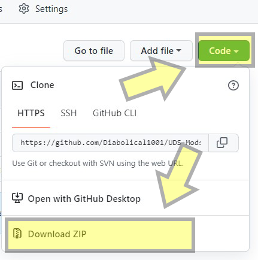
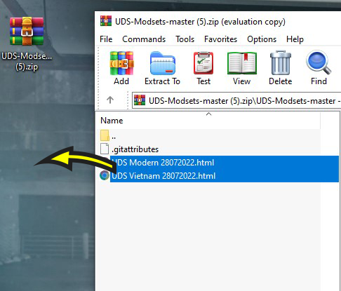
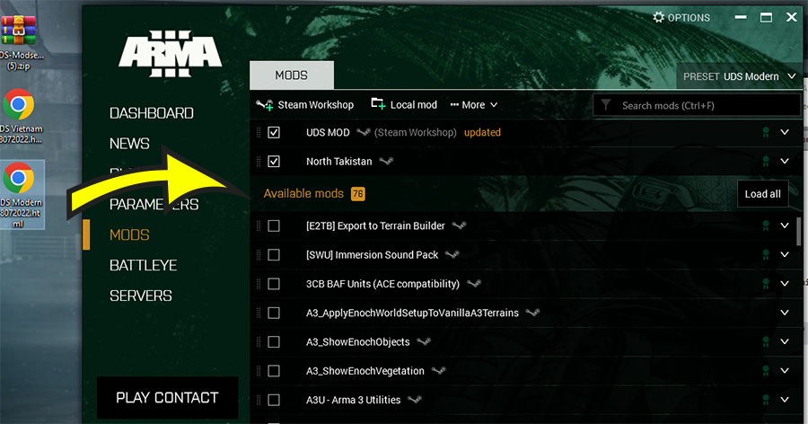
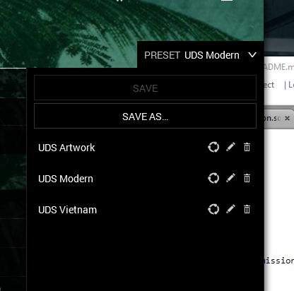

# UDS- Modsets
## Version: 29/07/2022

## How to install

- Download the files.

- Open the zip file and drag the two mission preset html's onto your desktop.

- Now drag the two html files (one at a time) onto your arma 3 launcher while in the MODS tab.

- Wait for the mods to download and your all done. You can now select the presets needed in the launcher from the presets drop down tab.

